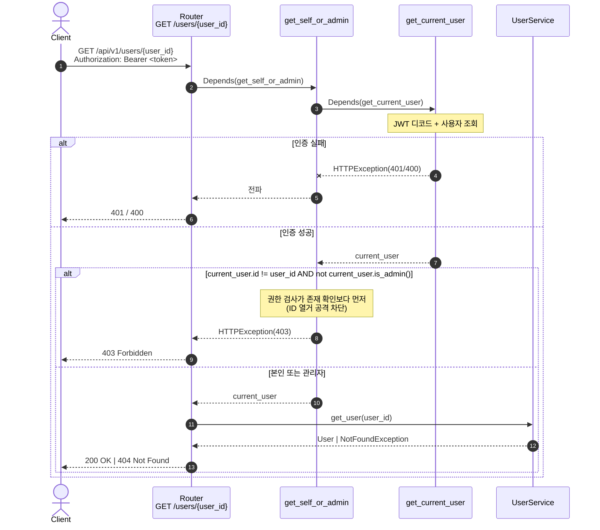

# 권한 분기 의존성 추출 구현 Plan

| 항목         | 내용                                                                  |
| ------------ | --------------------------------------------------------------------- |
| 작성일       | 2026-05-22                                                            |
| 연관 PRD     | [`[PRD]권한_분기_의존성_추출.md`](./[PRD]권한_분기_의존성_추출.md)   |
| 상태         | 제안 (Draft)                                                          |
| 추정 작업량  | 약 45 분 (구현 + 테스트 + 다이어그램 갱신)                             |
| 신규 의존성  | `get_self_or_admin(user_id, current_user) -> User`                    |

---

## 0. 사전 점검 (Pre-flight)

- [ ] `main` 기준 최신 상태에서 `feature/self-or-admin-dependency` 브랜치 생성
- [ ] `uv run pytest` 현재 34/34 PASS 확인
- [ ] PRD §4.1 의존성 정의 / §4.2 라우터 단순화 / §6.2 신규 테스트 1건 확인

---

## 1. 작업 분해

### Step 1. `app/api/dependencies.py` 에 `get_self_or_admin` 추가

**변경 내용**

기존 `get_current_active_admin` 다음에 새 의존성 함수 추가.

```python
# app/api/dependencies.py (파일 끝에 추가)
async def get_self_or_admin(
        user_id: int,
        current_user: User = Depends(get_current_user),
) -> User:
    """본인 또는 관리자만 통과하는 권한 가드.

    `user_id` 는 라우터의 path parameter 와 같은 이름으로 FastAPI 가 자동 주입.

    - 본인 (`current_user.id == user_id`) → 통과
    - 관리자 (`current_user.is_admin()`) → 통과
    - 그 외 → 403 Forbidden

    권한 검사는 자원의 존재 확인보다 먼저 평가되어 ID 열거 공격을 차단한다.
    """
    if current_user.id != user_id and not current_user.is_admin():
        raise HTTPException(
            status_code=status.HTTP_403_FORBIDDEN,
            detail="Not enough permissions",
        )
    return current_user
```

**검증**

```bash
/usr/local/bin/mise exec -- uv run python -c "
from app.api.dependencies import get_self_or_admin
import inspect
sig = inspect.signature(get_self_or_admin)
assert 'user_id' in sig.parameters
assert 'current_user' in sig.parameters
print('OK')
"
```

---

### Step 2. `app/user/router.py` 의 `get_user_by_id` 단순화

**변경 내용**

1. `from app.api.dependencies import get_self_or_admin` 추가 (이미 `get_current_active_admin, get_current_user` import 중)
2. `get_user_by_id` 의 의존성을 `get_current_user` → `get_self_or_admin` 으로 교체
3. 본문에서 권한 분기 5 줄 삭제

```python
# app/user/router.py (변경 후)
from app.api.dependencies import (
    get_current_active_admin,
    get_current_user,
    get_self_or_admin,
)

@router.get("/{user_id}", response_model=UserResponse)
async def get_user_by_id(
        user_id: int,
        _: User = Depends(get_self_or_admin),
        user_service: UserService = Depends(lambda: Container.user_service()),
) -> Any:
    """특정 사용자 정보를 조회합니다. 본인 또는 관리자만 접근 가능."""
    try:
        return await user_service.get_user(user_id)
    except NotFoundException as e:
        raise HTTPException(
            status_code=status.HTTP_404_NOT_FOUND,
            detail=str(e),
        )
```

> import 에 `User` 추가가 필요한지 확인. 본문에서 `User` 타입 어노테이션을 쓰지 않으면 import 불요 (`_: Any = Depends(...)` 형태로 둬도 됨). 본 Plan 은 `_: User` 로 명시 — `app.user.domain.User` import 추가.

**검증**

```bash
uv run pytest tests/user/test_router.py -k "get_user_by_id or get_other_user or nonexistent or without_auth" -v --tb=short
```

본 분기에 영향받는 5 케이스 PASS.

---

### Step 3. 신규 회귀 가드 추가

**대상**: `tests/user/test_router.py` (기존 파일 확장)

```python
@pytest.mark.asyncio
async def test_get_self_or_admin_blocks_before_existence_check(
        client: AsyncClient,
        auth_headers: Dict[str, str],
):
    """일반 사용자가 존재하지 않는 ID 를 조회해도 403 (404 가 아님).

    권한 검사가 존재 확인보다 먼저 평가됨을 자동 회귀로 보장한다.
    이는 ID 열거 공격 차단의 핵심 가드 — PR #2 의 보안 매트릭스에서
    수동 확인으로 남겨두었던 항목.
    """
    response = await client.get(
        "/api/v1/users/9999",
        headers=auth_headers,
    )
    assert response.status_code == 403
```

**검증**

```bash
uv run pytest tests/user/test_router.py::test_get_self_or_admin_blocks_before_existence_check -v --tb=short
```

1 케이스 PASS.

---

### Step 4. 다이어그램 갱신

**대상**: `docs/diagram/사용자_프로필.md`

`GET /api/v1/users/{user_id}` 섹션의 다이어그램에서 권한 분기를 의존성 단계로 이동.

- `Router` 의 본문 분기 → `get_self_or_admin` 의존성 단계로 표현
- 메모 추가: "권한 검사가 의존성에서 수행되어 라우터 본문은 비즈니스 로직만 담당"



---

### Step 5. 전체 회귀 검증

```bash
uv run pytest -v
```

기존 34 + 신규 1 = **35 PASS** 확인.

```bash
# 의존성 추출 효과 — 라우터 본문에 권한 분기 잔존 없음
grep -n "current_user.id !=\|current_user.is_admin" app/user/router.py
# → 출력 없음 (의존성으로 이동 완료)
```

---

## 2. 산출물 체크리스트

- [ ] `app/api/dependencies.py` — `get_self_or_admin` 함수 신규 추가
- [ ] `app/user/router.py` — import 갱신, `get_user_by_id` 단순화
- [ ] `tests/user/test_router.py` — 신규 회귀 가드 1 케이스
- [ ] `docs/diagram/사용자_프로필.md` — 다이어그램의 권한 분기 표현 갱신
- [ ] `uv run pytest -v` **35/35 PASS**
- [ ] `grep "current_user.id !=" app/user/router.py` 결과 없음

---

## 3. 테스트 케이스 (완료 판정 기준)

### 3.1 기존 5 케이스 (PASS 유지)

| 테스트                                       | 시나리오                              | 기대 |
| -------------------------------------------- | ------------------------------------- | ---- |
| `test_get_user_by_id`                        | 본인 토큰으로 본인 조회               | 200  |
| `test_get_user_by_id_without_auth`           | 인증 헤더 없음                        | 401  |
| `test_get_nonexistent_user`                  | 관리자 토큰으로 9999 조회             | 404  |
| `test_get_other_user_as_regular_user`        | 일반 토큰으로 타인 조회               | 403  |
| `test_get_other_user_as_admin`               | 관리자 토큰으로 타인 조회             | 200  |

### 3.2 신규 1 케이스

| #   | 테스트                                                | 시나리오                              | 기대 |
| --- | ----------------------------------------------------- | ------------------------------------- | ---- |
| 1   | `test_get_self_or_admin_blocks_before_existence_check` | 일반 토큰으로 존재하지 않는 9999 조회 | 403  |

### 3.3 ID 열거 차단 매트릭스 (PR #2 의 §4 갱신 — 본 PR 로 자동화 완료)

| 시나리오                              | 일반 사용자 토큰 응답 | 관리자 토큰 응답 |
| ------------------------------------- | --------------------- | ---------------- |
| 본인 ID 조회                          | 200                   | (해당 없음)      |
| 존재하는 타인 ID 조회                 | **403** (기존 가드)   | 200              |
| 존재하지 않는 ID 조회                 | **403** ← 본 PR 자동 가드 | 404           |

---

## 4. 회귀 방지 체크리스트

PR 머지 전 모두 확인.

- [ ] `uv run pytest` **35/35 PASS**
- [ ] `grep -n "current_user.id !=" app/user/router.py` 결과 없음 (권한 분기 본문 잔존 X)
- [ ] `grep -n "current_user.is_admin" app/user/router.py` 결과 없음 (admin 체크 본문 잔존 X)
- [ ] `app/api/dependencies.py` 에 `get_self_or_admin` 함수 존재 확인
- [ ] 다이어그램의 권한 분기 단계가 의존성 위치로 표현되었는지 확인
- [ ] 응답 코드 매트릭스 5 케이스 모두 변경 없음 (외부 동작 동일성)

---

## 5. 롤백 전략

- 본 작업은 `dependencies.py` + `router.py` + 테스트 + 다이어그램 = 4 파일.
- 별도 브랜치 (`feature/self-or-admin-dependency`) 에서 작업. 문제 시 `git checkout main` 으로 원복.
- `dependencies.py` 와 `router.py` 는 함께 변경되어야 일관성 유지 — 둘 중 하나만 되돌리면 import 에러.

---

## 6. 후속 작업 (별도 이슈 권장)

| #   | 항목                                                                          | 권장 처리                                                     |
| --- | ----------------------------------------------------------------------------- | ------------------------------------------------------------- |
| 1   | Product 도메인의 동일 패턴 (`{product_id}` 본인 또는 관리자 필요 시)         | Product 권한 정책이 명확해지면 동일 의존성 패턴 도입            |
| 2   | `get_staff_or_above` 의존성 추가 (`is_staff_or_above()` 활용)                | "STAFF 이상 권한 필요" 라우트가 생기면 추가                    |
| 3   | 권한 정책을 별도 모듈 (`app/api/permissions.py`) 로 분리                     | 의존성이 5개 이상으로 늘어나면 도입                            |
| 4   | 의존성의 path parameter 자동 주입 패턴 가이드라인 문서화                      | `docs/` 에 개발자 가이드 별도 작성                            |

---

## 7. 참고

- 관련 PRD: [`[PRD]권한_분기_의존성_추출.md`](./[PRD]권한_분기_의존성_추출.md)
- 핵심 코드:
  - `app/api/dependencies.py:60 get_current_active_admin` — 자매격 의존성
  - `app/user/router.py:82 get_user_by_id` — 수정 대상
- 관련 다이어그램: [`docs/diagram/사용자_프로필.md`](./diagram/사용자_프로필.md)
- 선례:
  - PR #2 (본인+관리자 정책 도입, 라우터 본문에 분기)
  - PR #4 (UserRole 도메인 메서드 + admin 가드)
