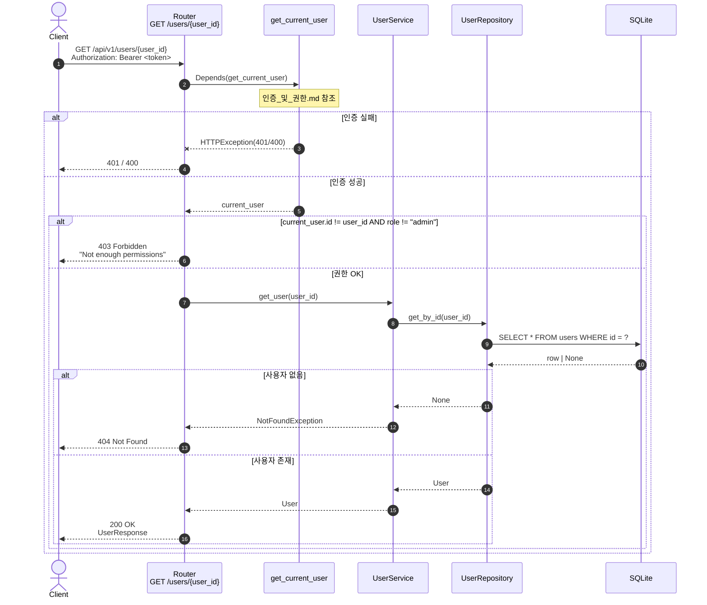

# 사용자 조회 엔드포인트 인증 누락 개선 구현 Plan

| 항목         | 내용                                                                 |
| ------------ | -------------------------------------------------------------------- |
| 작성일       | 2026-05-22                                                           |
| 연관 PRD     | [`[PRD]사용자_조회_인증_누락.md`](./[PRD]사용자_조회_인증_누락.md)   |
| 상태         | 제안 (Draft)                                                         |
| 추정 작업량  | 약 1시간 (구현 + 테스트 + 검증)                                       |
| 채택 정책    | **옵션 B — 본인 또는 관리자만 접근 가능**                            |
| 권한 평가 순서 | **권한 검사 → 존재 확인** (보안 best practice: 존재 여부 leak 방지) |

---

## 0. 사전 점검 (Pre-flight)

- [ ] `main` 기준 최신 상태에서 `feature/user-get-auth` 브랜치 생성
- [ ] `uv run pytest` 현재 18/18 PASS 확인
- [ ] PRD 의 정책 결정 사항 확인 (옵션 B 채택)
- [ ] PRD §7-#2 의 권한 평가 위치 (의존성 vs 본문 분기) 결정 확인 — **본 Plan 은 라우터 본문 분기 채택** (단순성 우선, 의존성 추출은 별도 리팩토링 이슈)

---

## 1. 작업 분해

### Step 1. 라우터 의존성 추가 및 시그니처 변경

**대상**: `app/user/router.py:82 get_user_by_id`

**변경 내용**

1. 상단 import 에 `get_current_user` 가 이미 있는지 확인 (이미 있음 — line 12)
2. 핸들러 시그니처에 `current_user: Any = Depends(get_current_user)` 추가
3. 본문에 권한 분기 추가 (존재 확인보다 먼저)

```python
@router.get("/{user_id}", response_model=UserResponse)
async def get_user_by_id(
        user_id: int,
        current_user: Any = Depends(get_current_user),
        user_service: UserService = Depends(lambda: Container.user_service())
) -> Any:
    """특정 사용자 정보를 조회합니다.

    정책: 본인 또는 관리자만 조회 가능.
    """
    if current_user.id != user_id and current_user.role != "admin":
        raise HTTPException(
            status_code=status.HTTP_403_FORBIDDEN,
            detail="Not enough permissions"
        )
    try:
        return await user_service.get_user(user_id)
    except NotFoundException as e:
        raise HTTPException(
            status_code=status.HTTP_404_NOT_FOUND,
            detail=str(e)
        )
```

> **권한 평가가 존재 확인보다 먼저** 인 이유: 일반 사용자가 ID 를 바꿔가며 404 / 403 응답 차이로 사용자 ID 의 존재 여부를 열거하는 공격을 차단.

**검증**

```bash
uv run pytest tests/user/test_router.py::test_get_user_by_id -x --tb=short
```

본인 조회 (test_user 가 본인 ID 로 조회) PASS 확인.

---

### Step 2. 기존 테스트 정합성 조정

**대상**: `tests/user/test_router.py`

**변경 내용**

`test_get_nonexistent_user` 는 현재 일반 사용자 토큰으로 9999 를 조회하면 404 를 기대한다. 그러나 옵션 B + 권한 우선 평가 하에서는 **403** 이 정확하다 (9999 는 본인이 아니므로 권한 부족).

**선택**: 의미를 보존하면서 테스트가 검증하려는 본질("존재하지 않는 사용자 조회 시 404") 을 유지하기 위해 **`admin_auth_headers` 로 변경** 한다. 관리자는 권한을 통과하므로 존재 확인 단계까지 진행되어 404 가 나온다.

```python
# Before
async def test_get_nonexistent_user(client: AsyncClient, auth_headers: Dict[str, str]):
    non_existent_id = 9999
    response = await client.get(f"/api/v1/users/{non_existent_id}", headers=auth_headers)
    assert response.status_code == 404
    ...

# After
async def test_get_nonexistent_user(client: AsyncClient, admin_auth_headers: Dict[str, str]):
    """존재하지 않는 사용자 조회 테스트. 관리자 컨텍스트에서 404 확인."""
    non_existent_id = 9999
    response = await client.get(f"/api/v1/users/{non_existent_id}", headers=admin_auth_headers)
    assert response.status_code == 404
    data = response.json()
    assert "detail" in data
```

**검증**

```bash
uv run pytest tests/user/test_router.py::test_get_nonexistent_user -x --tb=short
```

---

### Step 3. 신규 테스트 케이스 추가

**대상**: `tests/user/test_router.py`

다음 3개 케이스를 추가한다.

#### 3.1 인증 없이 호출 → 401

```python
async def test_get_user_by_id_without_auth(client: AsyncClient, test_user: Dict[str, Any]):
    """인증 헤더 없이 호출 시 401."""
    response = await client.get(f"/api/v1/users/{test_user['id']}")
    assert response.status_code == 401
```

#### 3.2 일반 사용자가 다른 사용자 조회 → 403

```python
async def test_get_other_user_as_regular_user(
        client: AsyncClient,
        auth_headers: Dict[str, str],
        admin_user: Dict[str, Any],
):
    """일반 사용자가 다른 사용자(여기서는 admin_user) 를 조회하면 403."""
    response = await client.get(
        f"/api/v1/users/{admin_user['id']}",
        headers=auth_headers,
    )
    assert response.status_code == 403
    data = response.json()
    assert "detail" in data
```

#### 3.3 관리자가 다른 사용자 조회 → 200

```python
async def test_get_other_user_as_admin(
        client: AsyncClient,
        admin_auth_headers: Dict[str, str],
        test_user: Dict[str, Any],
):
    """관리자는 다른 사용자도 조회 가능."""
    response = await client.get(
        f"/api/v1/users/{test_user['id']}",
        headers=admin_auth_headers,
    )
    assert response.status_code == 200
    data = response.json()
    assert data["id"] == test_user["id"]
    assert data["email"] == test_user["email"]
```

**검증**

```bash
uv run pytest tests/user/test_router.py -k "get_user or get_other_user or nonexistent" -v
```

---

### Step 4. 시퀀스 다이어그램 갱신

**대상**: `docs/diagram/사용자_프로필.md`

`GET /api/v1/users/{user_id}` 섹션을 다음과 같이 수정한다.

1. "**현재 구현은 인증 미적용**" 노트 제거
2. 다이어그램에 인증 + 권한 분기 단계 추가
3. 표 의 "의존성" 행을 `get_current_user` 로 갱신
4. 실패 응답에 `401`, `403` 추가



**검증**

마크다운 미리보기로 mermaid 가 정상 렌더링되는지 확인.

---

### Step 5. 전체 회귀 검증

```bash
uv run pytest -v
uv run pytest --cov=app/user --cov-report=term-missing
```

- 기존 18 + 신규 3 = **21 PASS** 확인
- `app/user/router.py` 의 라인 커버리지가 새 분기(권한 검사) 를 포함하는지 확인

---

## 2. 산출물 체크리스트

- [ ] `app/user/router.py:82 get_user_by_id` 시그니처/본문 수정
- [ ] `tests/user/test_router.py::test_get_nonexistent_user` 어드민 헤더로 조정
- [ ] `tests/user/test_router.py` 에 3개 신규 케이스 추가
- [ ] `docs/diagram/사용자_프로필.md` 의 해당 섹션 갱신
- [ ] `uv run pytest -v` 21/21 PASS

---

## 3. 테스트 케이스 (완료 판정 기준)

다음 **5 개 케이스가 모두 PASS** 해야 한다.

| #   | 테스트                                                         | 입력                                              | 기대             |
| --- | -------------------------------------------------------------- | ------------------------------------------------- | ---------------- |
| 1   | `test_get_user_by_id` (기존 유지)                              | 일반 사용자 토큰으로 본인 조회                    | 200 + 본인 정보  |
| 2   | `test_get_nonexistent_user` (수정 — admin_auth_headers 사용)   | 관리자 토큰으로 user_id=9999 조회                 | 404              |
| 3   | `test_get_user_by_id_without_auth` (신규)                      | 인증 헤더 없이 본인 ID 조회                       | 401              |
| 4   | `test_get_other_user_as_regular_user` (신규)                   | 일반 사용자 토큰으로 admin_user.id 조회           | 403              |
| 5   | `test_get_other_user_as_admin` (신규)                          | 관리자 토큰으로 test_user.id 조회                 | 200 + test_user 정보 |

---

## 4. 보안 회귀 가드 (열거 공격 차단 확인)

다음 시나리오에서 응답 코드가 **존재 여부를 누설하지 않는지** 수동 확인.

| 시나리오                                              | 일반 사용자 토큰 응답 | 관리자 토큰 응답 |
| ----------------------------------------------------- | --------------------- | ---------------- |
| 본인 ID 조회                                          | 200                   | (해당 없음)      |
| 존재하는 타인 ID 조회                                 | **403**               | 200              |
| 존재하지 않는 ID 조회                                 | **403** ← 핵심        | 404              |

> 일반 사용자에게는 **존재하는 타인** 과 **존재하지 않는 ID** 모두 동일하게 `403` 으로 응답되어야 한다. `404` 가 나오면 열거 공격 가능성이 있음.

수동 확인 명령:

```bash
# admin_user (id=1, role=admin) 를 일반 사용자 (id=2) 토큰으로 조회
curl -i -H "Authorization: Bearer <regular_token>" \
     http://localhost:8000/api/v1/users/1
# → 403

# 존재하지 않는 9999 를 일반 사용자 토큰으로 조회
curl -i -H "Authorization: Bearer <regular_token>" \
     http://localhost:8000/api/v1/users/9999
# → 403 (404 아님)
```

---

## 5. 회귀 방지 체크리스트

PR 머지 전 모두 확인.

- [ ] `uv run pytest` 21/21 PASS
- [ ] 단일 테스트 단독 실행도 PASS (`uv run pytest tests/user/test_router.py::test_get_other_user_as_regular_user`)
- [ ] `git diff main -- app/` 가 `app/user/router.py` 의 변경만 보여줌 (다른 라우터/서비스 미변경)
- [ ] `test_access_admin_endpoint_as_regular_user` 등 기존 권한 관련 테스트 영향 없음
- [ ] 다이어그램 mermaid 렌더링 확인

---

## 6. 롤백 전략

- 본 작업은 라우터 1 파일 + 테스트 1 파일 + 문서 1 파일 변경으로 제한된다.
- 별도 브랜치(`feature/user-get-auth`) 에서 작업하고, 문제 시 `git checkout main` 으로 원복.
- 라우터 변경만 즉시 revert 하려면 `git checkout HEAD -- app/user/router.py` 로 단독 복구 가능.

---

## 7. 후속 작업 (별도 이슈 권장)

| #   | 항목                                                                                   | 권장 처리                                                    |
| --- | -------------------------------------------------------------------------------------- | ------------------------------------------------------------ |
| 1   | 권한 검사 분기를 의존성으로 추출 (`get_self_or_admin(user_id: int)`)                   | 같은 패턴이 재발하면 클린업                                  |
| 2   | `UserRole` enum vs `app/api/dependencies.py:66`의 문자열 비교 정합성                   | 테스트 아키텍처 PRD 잔여 #1 과 함께 처리                     |
| 3   | `UserResponse` 의 필드 마스킹 (관리자 외에는 일부 필드 숨김)                          | 별도 PRD                                                     |
| 4   | 사용자 조회 감사 로그(audit) 도입                                                      | 별도 PRD                                                     |

---

## 8. 참고

- 관련 PRD: [`[PRD]사용자_조회_인증_누락.md`](./[PRD]사용자_조회_인증_누락.md)
- 관련 다이어그램: [`docs/diagram/사용자_프로필.md`](./diagram/사용자_프로필.md), [`docs/diagram/인증_및_권한.md`](./diagram/인증_및_권한.md)
- 핵심 코드:
  - `app/user/router.py:82` — 수정 대상
  - `app/api/dependencies.py:20` — `get_current_user`
  - `tests/user/test_router.py:82` — 수정 대상 + 신규 케이스 추가 위치
- 선례: PR #1 의 `GET /users/` admin 가드 추가 (동일 카테고리)
