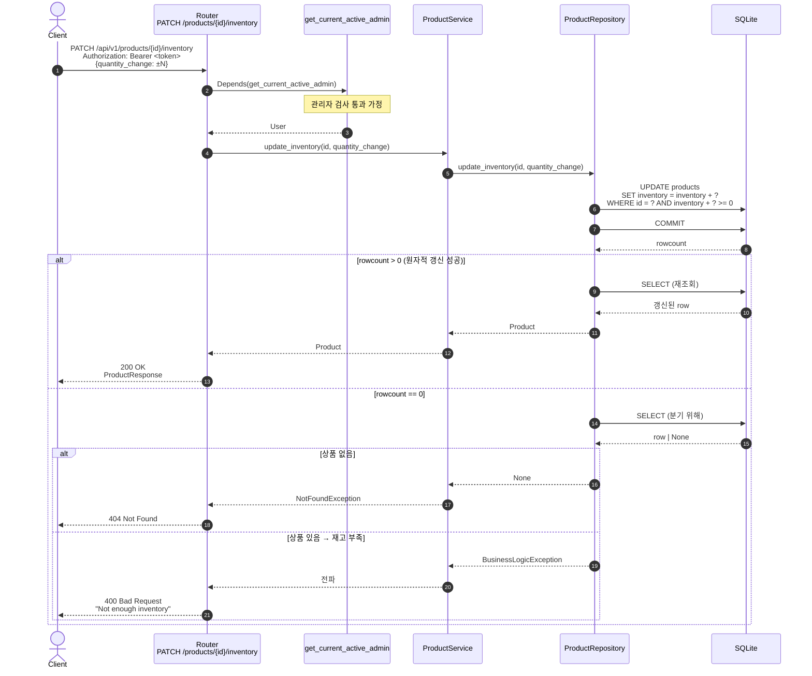

# 상품 재고 변경 원자성 보장 구현 Plan

| 항목         | 내용                                                               |
| ------------ | ------------------------------------------------------------------ |
| 작성일       | 2026-05-22                                                         |
| 연관 PRD     | [`[PRD]상품_재고_변경_원자성.md`](./[PRD]상품_재고_변경_원자성.md) |
| 상태         | 제안 (Draft)                                                       |
| 추정 작업량  | 약 2시간 (구현 + 테스트 + 검증)                                     |
| 채택 설계    | **옵션 A — 조건부 단일 UPDATE**                                    |
| 예외 위치    | repository (단순성 우선). enum 결과 패턴은 후속 리팩토링 후보       |

---

## 0. 사전 점검 (Pre-flight)

- [ ] `main` 기준 최신 상태에서 `feature/inventory-atomicity` 브랜치 생성
- [ ] `uv run pytest` 현재 21/21 PASS 확인
- [ ] PRD §4 의 옵션 A 채택 및 §8-#1 의 예외 위치 (repository) 결정 확인
- [ ] `app/core/exceptions.py` 의 `BusinessLogicException` 정의 위치 확인

---

## 1. 작업 분해

### Step 1. Repository 의 `update_inventory` 재작성

**대상**: `app/product/repository.py:108 update_inventory`

**변경 내용**

1. SELECT → 산술 → UPDATE → 음수 클램프 의 3-step 흐름을 제거
2. 조건부 단일 UPDATE 로 교체: `inventory = inventory + qc WHERE id = ? AND inventory + qc >= 0`
3. `rowcount == 0` 일 때만 후속 SELECT 로 "상품 없음" vs "재고 부족" 분기
4. `BusinessLogicException` 을 repository 에서 직접 raise

```python
# app/product/repository.py 상단 import 추가
from app.core.exceptions import BusinessLogicException

async def update_inventory(
    self, product_id: int, quantity_change: int
) -> Optional[Product]:
    """원자적 재고 변경.

    반환:
        Product : 성공
        None    : 상품 없음
    예외:
        BusinessLogicException : 재고 부족 (변경 시 음수 발생)
    """
    result = await self.session.execute(
        update(ProductModel)
        .where(ProductModel.id == product_id)
        .where(ProductModel.inventory + quantity_change >= 0)
        .values(inventory=ProductModel.inventory + quantity_change)
    )
    await self.session.commit()

    if result.rowcount == 0:
        # 갱신 실패 → 상품 없음 vs 재고 부족 구분
        product = await self.get_by_id(product_id)
        if product is None:
            return None
        raise BusinessLogicException(
            f"Not enough inventory for product {product_id}"
        )

    return await self.get_by_id(product_id)
```

**중점 검토**

- 음수 클램프 (`if new_inventory < 0: new_inventory = 0`) **완전히 제거** — silent failure 의 원인
- `ProductModel.inventory + quantity_change` 표현은 SQLAlchemy core 가 SQL 산술식으로 변환 (Python 단 계산 아님)
- WHERE 조건의 `>= 0` 비교가 NULL 컬럼에서 동작하는지 확인 필요 — `inventory` 컬럼은 NOT NULL 이어야 함 (현재 모델 확인 항목)

**검증**

```bash
uv run pytest tests/product/test_router.py::test_update_inventory_as_admin -x --tb=short
```

기존 정상 케이스 PASS 확인.

---

### Step 2. Service 의 `update_inventory` 단순화

**대상**: `app/product/service.py:73 update_inventory`

**변경 내용**

검증 로직이 repository 로 이전되었으므로 서비스는 위임만 수행.

```python
# app/product/service.py
async def update_inventory(
    self, product_id: int, quantity_change: int
) -> Product:
    """상품 재고를 업데이트합니다."""
    product = await self.product_repository.update_inventory(
        product_id, quantity_change
    )
    if product is None:
        raise NotFoundException(f"Product with ID {product_id} not found")
    return product
```

**제거되는 코드**

- 사전 SELECT (`get_by_id` 호출)
- 재고 부족 검증 (`if quantity_change < 0 and abs(quantity_change) > product.inventory`)
- `BusinessLogicException` raise — repository 로 이동

**검증**

```bash
uv run pytest tests/product/test_router.py -k "inventory" -v --tb=short
```

---

### Step 3. 기존 테스트 정합성 확인

**대상**: `tests/product/test_router.py`

**확인 사항**

- `test_update_inventory_as_admin` (기존) — 정상 케이스만 검증 중. 코드 변경 후에도 PASS 기대.
- 추가 테스트는 Step 4 에서 작성.

> **수정할 기존 케이스 없음.** Step 2 의 서비스 단순화는 외부 시그니처(반환 타입/예외) 를 유지하므로 호환.

---

### Step 4. 신규 테스트 케이스 추가

**대상**: `tests/product/test_router.py`

다음 3 개 케이스 추가.

#### 4.1 경계 — 재고 정확히 0 으로 만들기

```python
@pytest.mark.asyncio
async def test_update_inventory_exact_zero(
        client: AsyncClient,
        admin_auth_headers: Dict[str, str],
        test_product: Dict[str, Any],
):
    """quantity_change 가 현재 재고와 정확히 일치 → 200 + inventory=0."""
    # test_product fixture: inventory=10
    response = await client.patch(
        f"/api/v1/products/{test_product['id']}/inventory",
        headers=admin_auth_headers,
        json={"quantity_change": -10},
    )

    assert response.status_code == 200
    assert response.json()["inventory"] == 0
```

#### 4.2 재고 부족 → 400

```python
@pytest.mark.asyncio
async def test_update_inventory_insufficient(
        client: AsyncClient,
        admin_auth_headers: Dict[str, str],
        test_product: Dict[str, Any],
):
    """현재 재고보다 1 많이 차감 시도 → 400 + 재고는 그대로."""
    # test_product fixture: inventory=10
    response = await client.patch(
        f"/api/v1/products/{test_product['id']}/inventory",
        headers=admin_auth_headers,
        json={"quantity_change": -11},
    )

    assert response.status_code == 400
    data = response.json()
    assert "detail" in data

    # 재고가 변경되지 않았는지 확인 (silent failure 방지)
    get_response = await client.get(f"/api/v1/products/{test_product['id']}")
    assert get_response.status_code == 200
    assert get_response.json()["inventory"] == 10
```

#### 4.3 동시 차감 시 1건만 성공 (구조적 가드)

```python
@pytest.mark.asyncio
async def test_update_inventory_concurrent_deduction(
        client: AsyncClient,
        admin_auth_headers: Dict[str, str],
        test_product: Dict[str, Any],
):
    """동시 차감 2건 (-10, -10) 시 정확히 1건만 200, 1건은 400.

    StaticPool 단일 커넥션 환경이라 실제 OS 레벨 race 재현은 어렵지만,
    조건부 UPDATE 의 시멘틱이 정상 동작하는지 구조적으로 검증한다.
    """
    import asyncio

    # test_product fixture: inventory=10
    responses = await asyncio.gather(
        client.patch(
            f"/api/v1/products/{test_product['id']}/inventory",
            headers=admin_auth_headers,
            json={"quantity_change": -10},
        ),
        client.patch(
            f"/api/v1/products/{test_product['id']}/inventory",
            headers=admin_auth_headers,
            json={"quantity_change": -10},
        ),
    )

    statuses = sorted(r.status_code for r in responses)
    assert statuses == [200, 400], f"기대: [200, 400], 실제: {statuses}"

    # 최종 재고는 0 (음수 아님)
    get_response = await client.get(f"/api/v1/products/{test_product['id']}")
    assert get_response.json()["inventory"] == 0
```

> **동시성 테스트 주의**: 본 테스트는 SQLite/StaticPool 단일 커넥션 환경에서는 실제 병렬 실행이 일어나지 않을 수 있다. 그래도 **(a) 조건부 UPDATE 의 분기가 정확히 두 가지 결과로 갈리는지**, **(b) 음수 재고가 발생하지 않는지** 의 두 가지 구조적 정합성은 검증된다. 실 운영에서의 race 검증은 부하 테스트로 별도 수행 권장.

**검증**

```bash
uv run pytest tests/product/test_router.py -k "inventory" -v --tb=short
```

신규 3 + 기존 1 = 4 케이스 모두 PASS 확인.

---

### Step 5. 시퀀스 다이어그램 갱신

**대상**: `docs/diagram/상품_관리_관리자.md`

`PATCH /products/{id}/inventory` 섹션의 다이어그램을 단순화된 흐름으로 교체:



핵심 포인트 갱신:

- 음수 클램프 제거 → silent failure 해소
- 단일 UPDATE 로 원자성 확보
- "race condition" 경고 문구 제거 또는 "해결됨" 로 갱신
- repository 가 `BusinessLogicException` 을 던지는 아키텍처 결정 명시

---

### Step 6. 전체 회귀 검증

```bash
uv run pytest -v
uv run pytest --cov=app/product --cov-report=term-missing
```

- 기존 21 + 신규 3 = **24 PASS** 확인
- `app/product/repository.py update_inventory` 의 모든 분기 (성공 / 상품 없음 / 재고 부족) 가 커버되는지 확인

---

## 2. 산출물 체크리스트

- [ ] `app/product/repository.py:108 update_inventory` 조건부 UPDATE 로 재작성
- [ ] 음수 클램프 코드 (`if new_inventory < 0: new_inventory = 0`) 완전 제거
- [ ] `app/product/service.py:73 update_inventory` 검증 로직 제거 및 위임으로 단순화
- [ ] `tests/product/test_router.py` 에 3 개 신규 케이스 추가
- [ ] `docs/diagram/상품_관리_관리자.md` 의 재고 변경 섹션 갱신
- [ ] `uv run pytest -v` 24/24 PASS

---

## 3. 테스트 케이스 (완료 판정 기준)

다음 **4 개 케이스가 모두 PASS** 해야 한다.

| #   | 테스트                                          | 입력 (재고=10 기준)            | 기대                                |
| --- | ----------------------------------------------- | ------------------------------ | ----------------------------------- |
| 1   | `test_update_inventory_as_admin` (기존)         | +5                             | 200 + inventory=15                  |
| 2   | `test_update_inventory_exact_zero` (신규)       | -10                            | 200 + inventory=0                   |
| 3   | `test_update_inventory_insufficient` (신규)     | -11                            | 400 + 재고 변경 없음 (10 유지)      |
| 4   | `test_update_inventory_concurrent_deduction` (신규) | -10, -10 동시               | [200, 400] + 최종 재고=0            |

---

## 4. 회귀 가드 — 음수 재고 방지 매트릭스

다음 시나리오에서 **음수 재고 발생 0건** 을 보장.

| 시나리오                          | 변경 전 동작                                              | 변경 후 기대                          |
| --------------------------------- | --------------------------------------------------------- | ------------------------------------- |
| 단일 요청 -10 (재고=10)           | 200, inventory=0                                          | 200, inventory=0 (동일)               |
| 단일 요청 -11 (재고=10)           | 400 (서비스 검증)                                         | 400 (DB 조건)                         |
| 동시 -10, -10 (재고=10)           | 둘 다 200 가능. inventory=0 (clamp). **silent failure**  | [200, 400], inventory=0               |
| 동시 -10, -5 (재고=10)            | 가능: 둘 다 200, inventory=-5→0 (clamp). silent failure   | [200, 400] 또는 [200, 200] (재고 5 분할 가능 시) |

> **silent failure 제거 확인**: 변경 후에는 재고 부족 시 무조건 명시적 400. 음수 클램프가 없으므로 부족분이 "조용히 사라지는" 케이스 없음.

---

## 5. 회귀 방지 체크리스트

PR 머지 전 모두 확인.

- [ ] `uv run pytest` 24/24 PASS
- [ ] `git diff main -- app/product/repository.py` 에서 음수 클램프 라인이 **삭제됨** 확인
- [ ] `git diff main -- app/product/service.py` 에서 `BusinessLogicException` 의 raise 가 **삭제됨** 확인 (repository 로 이동)
- [ ] `app/product/service.py` 의 `update_inventory` 가 검증 없이 위임만 수행하는지 확인
- [ ] 다이어그램의 race condition 관련 노트가 "해결됨" 으로 갱신되었는지 확인
- [ ] 다른 product 메서드 (`create`, `update`, `delete`, `list`, `get_by_id`) 의 동작 변경 없음 (git diff 로 확인)

---

## 6. 롤백 전략

- 본 작업은 `app/product/repository.py` + `app/product/service.py` + 테스트 + 다이어그램 = 4 파일 변경.
- 별도 브랜치 (`feature/inventory-atomicity`) 에서 작업. 문제 시 `git checkout main` 으로 원복.
- 두 파일 중 service 만 단독으로 되돌리면 일관성이 깨지므로 (검증 누락) 반드시 두 파일을 함께 revert.

---

## 7. 후속 작업 (별도 이슈 권장)

| #   | 항목                                                                              | 권장 처리                                                       |
| --- | --------------------------------------------------------------------------------- | --------------------------------------------------------------- |
| 1   | repository 가 도메인 예외 (`BusinessLogicException`) 를 던지는 패턴               | 다른 도메인에서 동일 패턴이 반복되면 enum 결과 패턴 으로 리팩토링 |
| 2   | 재고 변경 audit log (누가/언제/얼마나) 도입                                      | 별도 PRD                                                        |
| 3   | 부하 테스트 — 실제 OS 레벨 race 검증                                             | locust 또는 k6 등으로 별도 부하 테스트 환경 구축                 |
| 4   | `inventory` 컬럼이 NOT NULL 인지 확인 (NULL 일 경우 `inventory + qc >= 0` 미동작) | 모델 점검 후 필요 시 마이그레이션                              |
| 5   | 재고 0 인 상품 자동 비활성화                                                      | 별도 이슈 — 비즈니스 정책 결정 필요                             |

---

## 8. 참고

- 관련 PRD: [`[PRD]상품_재고_변경_원자성.md`](./[PRD]상품_재고_변경_원자성.md)
- 관련 다이어그램: [`docs/diagram/상품_관리_관리자.md`](./diagram/상품_관리_관리자.md) (재고 변경 섹션)
- 핵심 코드:
  - `app/product/repository.py:108` — 수정 대상 (조건부 UPDATE)
  - `app/product/service.py:73` — 수정 대상 (단순화)
  - `app/core/exceptions.py` — `BusinessLogicException` 정의
  - `tests/product/test_router.py` — 신규 케이스 추가 위치
- SQLAlchemy 2.0 UPDATE 표현: https://docs.sqlalchemy.org/en/20/tutorial/data_update.html
