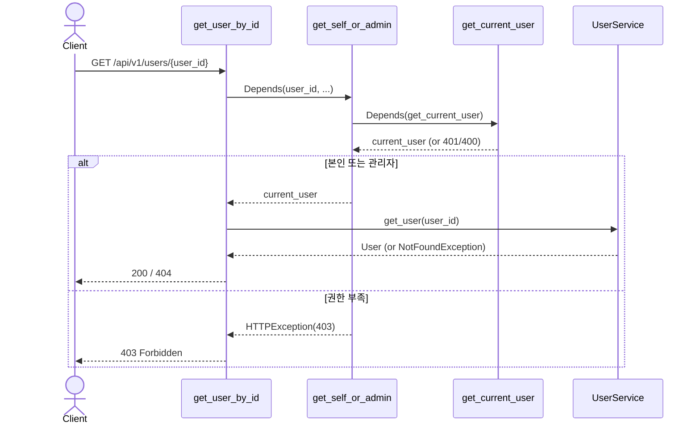

# 권한 분기 의존성 추출 PRD

| 항목       | 내용                                                                                |
| ---------- | ----------------------------------------------------------------------------------- |
| 작성일     | 2026-05-22                                                                          |
| 작성자     | conner                                                                              |
| 상태       | 제안 (Draft)                                                                        |
| 도메인     | API 의존성 / 권한                                                                   |
| 대상 범위  | `app/api/dependencies.py`, `app/user/router.py:82 get_user_by_id`                  |
| 관련 발견  | 사용자 조회 PR #2 §7-#1, UserRole PR #4 §7-#1 의 잔여 후속                          |

---

## 1. 배경

### 1.1 현재 구조

`get_user_by_id` 라우터 본문에 권한 분기가 있다.

```python
# app/user/router.py:82-94
@router.get("/{user_id}", response_model=UserResponse)
async def get_user_by_id(
        user_id: int,
        current_user: Any = Depends(get_current_user),
        user_service: UserService = Depends(...),
) -> Any:
    """특정 사용자 정보를 조회합니다. 본인 또는 관리자만 접근 가능."""
    # 권한 검사를 존재 확인보다 먼저 수행하여 ID 열거 공격 차단
    if current_user.id != user_id and not current_user.is_admin():
        raise HTTPException(
            status_code=status.HTTP_403_FORBIDDEN,
            detail="Not enough permissions"
        )
    try:
        return await user_service.get_user(user_id)
    except NotFoundException as e:
        raise HTTPException(...)
```

### 1.2 문제점

- **권한 정책이 라우터 본문에 위치**: 비즈니스 로직과 권한 검사가 섞임.
- **재사용 불가**: 다른 라우트에서 같은 "본인 또는 관리자" 정책이 필요해도 코드 중복 발생.
- **테스트 시 권한 분기만 격리 검증 어려움**: 라우터 통합 테스트로만 가능.

이미 `get_current_active_admin` 같은 admin 전용 가드는 의존성으로 추출되어 있는데(`app/api/dependencies.py:60-70`), self+admin 패턴만 라우터 본문에 남아있는 비대칭 상태.

### 1.3 FastAPI 의 path parameter 자동 주입

FastAPI 의존성 함수는 라우터와 **동일한 이름의 path parameter** 를 자동으로 받을 수 있다. 따라서 `get_self_or_admin(user_id: int, ...)` 형태로 정의하면 라우터의 `user_id` 가 자동 연결된다.

---

## 2. 목적

- 권한 정책 (본인 또는 관리자) 을 도메인 어휘로 재사용 가능한 의존성으로 추출.
- 라우터 본문에서 권한 분기 코드 제거 → 핸들러는 비즈니스 로직만 담당.
- 기존 admin 가드 (`get_current_active_admin`) 와 동일한 패턴/위치/네이밍으로 정합.
- 향후 동일 패턴의 라우트 추가 시 즉시 재사용 가능.

### 비목적

- 다른 권한 정책 (예: 본인만, STAFF 이상) 의 추가 의존성 도입 — 필요 시점에 추가.
- 권한 정책 모듈 (`permissions.py`) 별도 도입 — 본 PR 은 dependencies.py 안에서 함수 1개 추가.
- 라우터 권한 정책 변경 — 현재 PR #2 의 \"본인 또는 관리자\" 정책 유지.
- audit log 등 부수 기능.

---

## 3. 성공 기준

| 지표                                                                          | 목표값          |
| ----------------------------------------------------------------------------- | --------------- |
| `get_user_by_id` 라우터 본문에서 권한 분기 코드 제거                          | 0 줄 잔존       |
| `get_self_or_admin` 의존성 신규 추가                                          | 1 개             |
| 기존 회귀 테스트 (`test_get_user_by_id` 등 5 케이스)                          | 모두 PASS 유지   |
| 응답 코드 매트릭스 (401 / 403 / 404 / 200)                                    | 동일 유지        |
| 신규 회귀 가드                                                                | 신규 0 ~ 1 케이스 |

---

## 4. 설계

### 4.1 `get_self_or_admin` 의존성 정의

```python
# app/api/dependencies.py (추가)
async def get_self_or_admin(
        user_id: int,
        current_user: User = Depends(get_current_user),
) -> User:
    """본인 또는 관리자만 통과하는 권한 가드.

    `user_id` 는 라우터의 path parameter 와 같은 이름으로 FastAPI 가 자동 주입.

    - 본인 (`current_user.id == user_id`) → 통과
    - 관리자 (`current_user.is_admin()`) → 통과
    - 그 외 → 403 Forbidden

    권한 검사는 자원의 존재 확인보다 먼저 평가되어 ID 열거 공격을 차단한다.
    """
    if current_user.id != user_id and not current_user.is_admin():
        raise HTTPException(
            status_code=status.HTTP_403_FORBIDDEN,
            detail="Not enough permissions",
        )
    return current_user
```

### 4.2 라우터 단순화

```python
# app/user/router.py:82 (변경 후)
@router.get("/{user_id}", response_model=UserResponse)
async def get_user_by_id(
        user_id: int,
        _: User = Depends(get_self_or_admin),
        user_service: UserService = Depends(lambda: Container.user_service()),
) -> Any:
    """특정 사용자 정보를 조회합니다. 본인 또는 관리자만 접근 가능."""
    try:
        return await user_service.get_user(user_id)
    except NotFoundException as e:
        raise HTTPException(
            status_code=status.HTTP_404_NOT_FOUND,
            detail=str(e),
        )
```

**주요 변경**:
- `current_user: Any = Depends(get_current_user)` → `_: User = Depends(get_self_or_admin)`
- 라우터 본문의 `if current_user.id != user_id and not current_user.is_admin(): raise ...` 5 줄 삭제
- 본문이 단순한 service 호출 + 404 매핑만 남음

> `_` 변수 이름은 \"의존성을 평가하지만 결과는 사용하지 않음\" 의미. `list_users` 의 admin 가드와 동일 패턴.

### 4.3 의존성 호출 흐름



---

## 5. 영향 받는 파일

| 파일                          | 변경 종류                                                       | 비고                                                              |
| ----------------------------- | --------------------------------------------------------------- | ----------------------------------------------------------------- |
| `app/api/dependencies.py`     | `get_self_or_admin` 함수 신규 추가                              | 약 15 줄                                                          |
| `app/user/router.py`          | `get_user_by_id` 단순화 — 의존성 교체 + 본문 분기 5줄 삭제      | 시그니처 변경 1, 본문 -5                                          |
| `docs/diagram/사용자_프로필.md` | 다이어그램의 권한 분기 단계 갱신                              | `get_self_or_admin` 로 치환                                       |

---

## 6. 테스트 영향

### 6.1 기존 (PASS 유지)

| 테스트                                       | 시나리오                              | 기대 응답 |
| -------------------------------------------- | ------------------------------------- | --------- |
| `test_get_user_by_id`                        | 본인 토큰으로 본인 조회               | 200       |
| `test_get_user_by_id_without_auth`           | 인증 헤더 없음                        | 401       |
| `test_get_nonexistent_user`                  | 관리자 토큰으로 9999 조회             | 404       |
| `test_get_other_user_as_regular_user`        | 일반 토큰으로 타인 조회               | 403       |
| `test_get_other_user_as_admin`               | 관리자 토큰으로 타인 조회             | 200       |

**외부 동작 동일** — 신규 테스트 불요. 다만 한 가지 추가 검증을 권장:

### 6.2 추가 권장 (선택)

```python
# tests/user/test_router.py 추가 (또는 기존 확장)

async def test_get_self_or_admin_blocks_before_existence_check(
        client: AsyncClient,
        auth_headers: Dict[str, str],
):
    """존재하지 않는 ID 도 일반 사용자에게는 403 (404 가 아님) — ID 열거 차단."""
    response = await client.get(
        "/api/v1/users/9999",
        headers=auth_headers,
    )
    assert response.status_code == 403  # 404 가 아님
```

> 이 케이스는 PR #2 의 보안 회귀 가드 매트릭스에서 \"수동 확인\" 으로 두었던 항목. 본 PR 에서 의존성으로 추출하면서 자동화하는 것이 자연스러움.

---

## 7. 리스크 및 미해결 이슈

| #   | 항목                                                                             | 대응                                                                   |
| --- | -------------------------------------------------------------------------------- | ---------------------------------------------------------------------- |
| 1   | FastAPI 의존성의 path parameter 자동 주입 동작 검증                              | 모든 케이스를 통합 테스트로 검증 — 5 + 1 케이스                        |
| 2   | 의존성 이름 (`get_self_or_admin`) 이 추후 다른 도메인 (Product 등) 에 맞지 않음 | 본 PR 은 User 도메인에 한정. Product 의 동일 패턴은 별도 PR 에서 도입 |
| 3   | `_` 패턴이 검사 통과 시 의존성 값 미활용                                         | `list_users` 와 동일 패턴 — 일관성 OK                                  |
| 4   | `get_current_active_admin` 과 `get_self_or_admin` 의 사용 시점 혼동             | 라우터별 명확한 정책 (admin 전용 vs self+admin) 으로 구분 가능          |

### 결정 사항 (확정)

- [x] 의존성 이름: `get_self_or_admin` (기존 `get_current_active_admin` 과 동일 prefix)
- [x] 위치: `app/api/dependencies.py` (기존 가드와 동일 파일)
- [x] 반환: `User` 객체 (필요 시 라우터에서 사용 가능. 본 PR 의 라우터는 `_` 로 받음)
- [x] 추가 테스트: 위 §6.2 의 \"존재하지 않는 ID → 403\" 1 케이스 추가 (자동화 가치 큼)

---

## 8. 참고

- 관련 PRD: [`[PRD]사용자_조회_인증_누락.md`](./[PRD]사용자_조회_인증_누락.md), [`[PRD]UserRole_enum_정합성.md`](./[PRD]UserRole_enum_정합성.md)
- 핵심 코드:
  - `app/api/dependencies.py:60-70 get_current_active_admin` — 본 의존성의 자매격
  - `app/user/router.py:82-94 get_user_by_id` — 수정 대상
- 선례:
  - PR #2 (본인+관리자 정책 도입)
  - PR #4 (UserRole 도메인 메서드 + admin 가드 클래스화)
