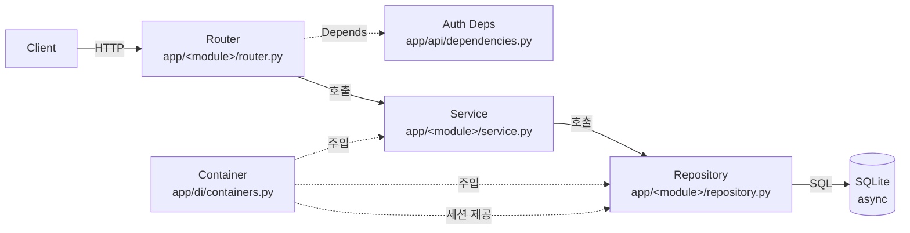

# 시퀀스 다이어그램

`app/` 의 엔트리포인트별 동작 흐름을 mermaid 시퀀스 다이어그램으로 정리한다.

## 인덱스

| 파일                                                       | 다루는 엔드포인트                                                                                                                     |
| ---------------------------------------------------------- | ------------------------------------------------------------------------------------------------------------------------------------- |
| [`인증_및_권한.md`](./인증_및_권한.md)                     | `get_current_user`, `get_current_active_admin` 의존성 (다른 모든 보호 엔드포인트의 사전 단계)                                          |
| [`회원가입_로그인.md`](./회원가입_로그인.md)               | `POST /api/v1/users/`, `POST /api/v1/users/token`                                                                                     |
| [`사용자_프로필.md`](./사용자_프로필.md)                   | `GET /api/v1/users/me`, `PUT /api/v1/users/me`, `GET /api/v1/users/{user_id}`                                                         |
| [`사용자_목록_관리자.md`](./사용자_목록_관리자.md)         | `GET /api/v1/users/`                                                                                                                  |
| [`상품_조회.md`](./상품_조회.md)                           | `GET /api/v1/products/{product_id}`, `GET /api/v1/products/`                                                                          |
| [`상품_관리_관리자.md`](./상품_관리_관리자.md)             | `POST · PUT · DELETE /api/v1/products/{product_id}`, `PATCH /api/v1/products/{product_id}/inventory`                                  |

## 공통 아키텍처

모든 엔트리포인트는 동일한 4계층을 따른다. 의존성은 `dependency_injector.Container` 가 주입하고, 데이터 액세스는 SQLAlchemy 2.0 의 비동기 세션(`async_scoped_session`)을 사용한다.

## 공통 규약

- **응답 코드 매핑**: 서비스 계층 예외 → 라우터에서 HTTP 상태로 변환
  - `ValidationException` → 400
  - `NotFoundException` → 404
  - `BusinessLogicException` → 400
  - 인증 실패 → 401
  - 권한 부족 → 403
- **세션 스코프**: `async_scoped_session(scopefunc=asyncio.current_task)` — 동일 요청 컨텍스트 내 동일 세션 공유
- **비동기 일관성**: 모든 router/service/repository 메서드는 `async def`
- **JWT**: `app.core.security.create_access_token` / `decode_access_token` 으로 발급·검증, payload `sub` 에 user_id 저장

## 표기 규칙

- `actor Client` : 외부 요청 주체 (브라우저, curl 등)
- `participant Router` : FastAPI 라우터 (의존성 해석 포함)
- `participant Service` : 도메인 비즈니스 로직
- `participant Repository` : DB 접근 어댑터
- `participant DB` : SQLite (aiosqlite)
- `alt / else` : 분기. 좌측이 정상 경로, 우측이 예외 경로
- `Note over X` : 부가 설명 / 사이드이펙트
