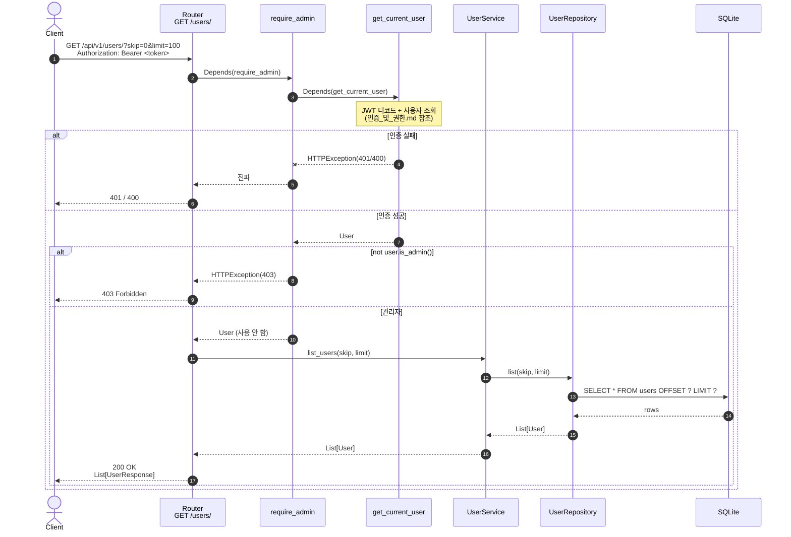

# 사용자 목록 (관리자 전용)

전체 사용자 리스트 조회. **관리자 권한 필수.**

## `GET /api/v1/users/`

| 항목       | 값                                                              |
| ---------- | --------------------------------------------------------------- |
| 핸들러     | `app/user/router.py:97 list_users`                              |
| 의존성     | `require_admin`                                      |
| 쿼리 파라미터 | `skip` (기본 0), `limit` (기본 100)                          |
| 성공       | `200 OK` + `List[UserResponse]`                                 |
| 실패       | `401` (인증 실패) · `403` (관리자 아님)                         |

## 핵심 포인트

- **이 엔드포인트의 admin 가드는 PR #1 에서 추가된 보안 픽스** 다. 이전 버전에서는 인증만 거치면 누구나 전체 사용자 리스트를 조회할 수 있었다.
- 페이징은 단순 `OFFSET / LIMIT` 방식. 대규모 데이터셋에서는 keyset pagination 으로의 전환 검토 필요.
- 결과 직렬화는 `response_model=List[UserResponse]` 가 처리 → `hashed_password` 등 민감 필드 자동 제외.
- 라우터 시그니처의 `_: Any = Depends(require_admin)` 는 의존성을 강제로 평가하되 값 자체는 사용하지 않는 패턴. 인증된 사용자 객체가 필요하다면 `current_user: Any = Depends(require_admin)` 로 받아 쓰면 된다.
