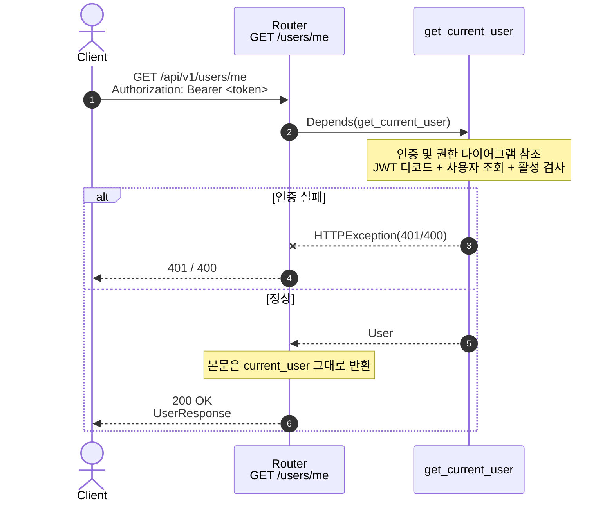
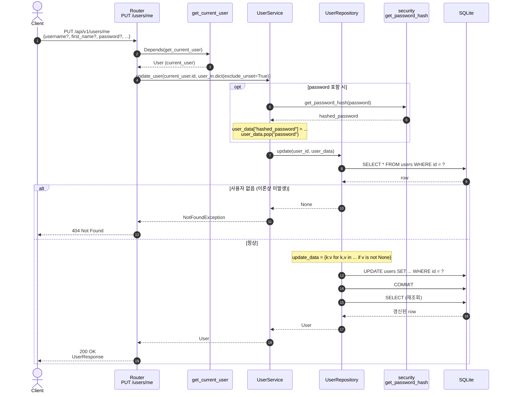
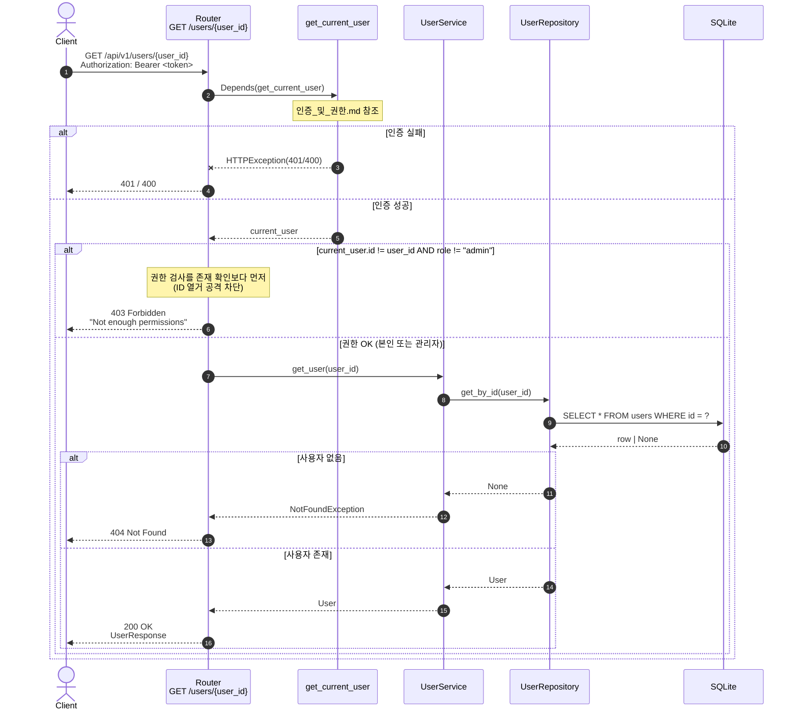

# 사용자 프로필

본인 정보 조회/수정과 다른 사용자 정보 조회. 세 엔드포인트 모두 **인증 필요** (관리자 권한은 불요).

## 1. 내 정보 조회 — `GET /api/v1/users/me`

| 항목       | 값                                                      |
| ---------- | ------------------------------------------------------- |
| 핸들러     | `app/user/router.py:37 get_current_user_info`           |
| 의존성     | `get_current_user`                                      |
| 성공       | `200 OK` + `UserResponse`                               |
| 실패       | `401` (인증 실패) · `400` (비활성 사용자)              |

### 핵심 포인트

- 라우터 본문은 추가 DB 조회 없이 의존성에서 받은 `User` 를 그대로 반환한다.
- 직렬화는 `response_model=UserResponse` 에 의해 자동 처리 → `hashed_password` 노출 방지.

---

## 2. 내 정보 수정 — `PUT /api/v1/users/me`

| 항목       | 값                                                              |
| ---------- | --------------------------------------------------------------- |
| 핸들러     | `app/user/router.py:45 update_current_user`                     |
| 의존성     | `get_current_user`                                              |
| 요청 본문  | `UserUpdate` (부분 업데이트, `exclude_unset=True` 적용)         |
| 성공       | `200 OK` + 갱신된 `UserResponse`                                |
| 실패       | `401` · `400` · `404` (이론상 발생 안 함, 인증 직후 본인 ID)   |

### 핵심 포인트

- **부분 업데이트**: 라우터에서 `user_in.dict(exclude_unset=True)` 로 호출자가 보낸 필드만 전달. 추가로 repository 의 `update` 가 `v is not None` 인 값만 갱신하므로 명시적 `null` 도 무시된다.
- **password 변경**: 서비스 계층에서 `password` → `hashed_password` 로 키 변환. 라우터/리포지토리는 평문을 모른다.
- repository `update` 는 UPDATE 후 SELECT 로 재조회한 결과를 반환 → 트리거나 DB 기본값을 반영.

---

## 3. 특정 사용자 조회 — `GET /api/v1/users/{user_id}`

| 항목       | 값                                                                                |
| ---------- | --------------------------------------------------------------------------------- |
| 핸들러     | `app/user/router.py:82 get_user_by_id`                                            |
| 의존성     | `get_current_user`                                                                |
| 권한 정책  | **본인 또는 관리자만**                                                            |
| 성공       | `200 OK` + `UserResponse`                                                         |
| 실패       | `401` (인증 실패) · `400` (비활성 사용자) · `403` (권한 부족) · `404` (사용자 없음) |

### 핵심 포인트

- **권한 평가가 존재 확인보다 먼저** 다. 일반 사용자가 ID 를 바꿔가며 `403` vs `404` 응답 차이로 사용자 ID 의 존재 여부를 열거하는 공격을 차단한다.
  - 일반 사용자가 **존재하는 타인 ID** 조회 → `403`
  - 일반 사용자가 **존재하지 않는 ID** 조회 → `403` (동일)
  - 관리자만 `404` 를 받을 수 있음
- `role == "admin"` 문자열 비교는 `app/api/dependencies.py:66` 의 admin 가드와 동일한 패턴. enum 정합성은 별도 이슈.
