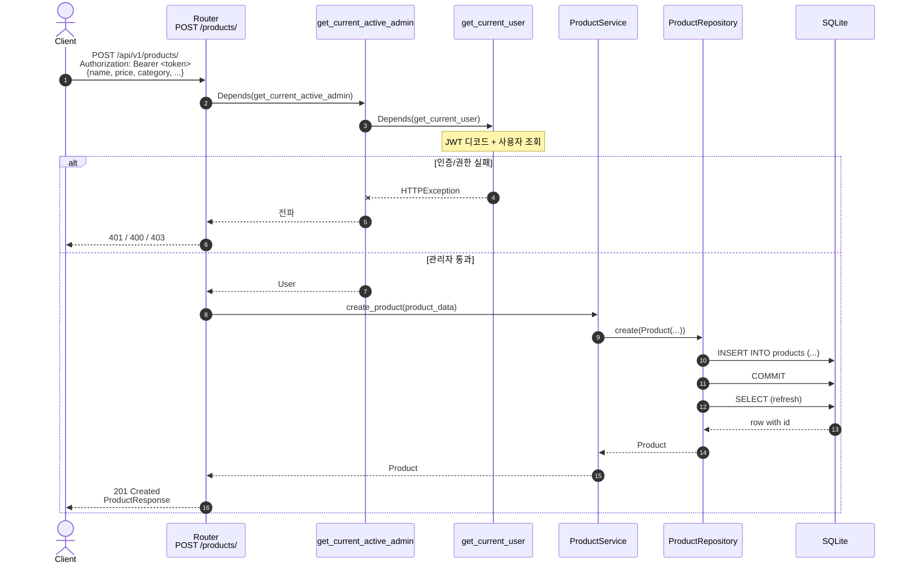
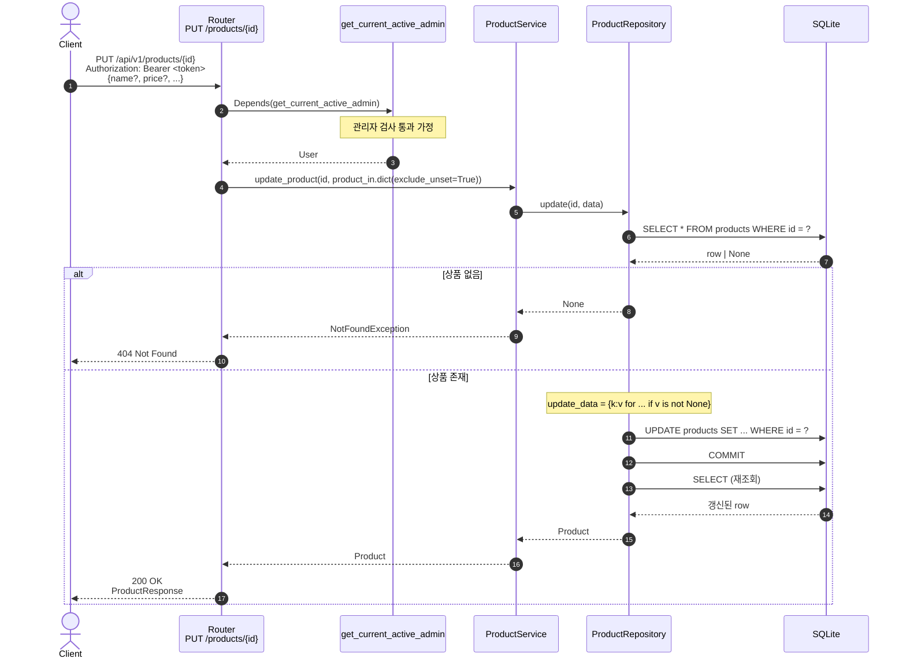
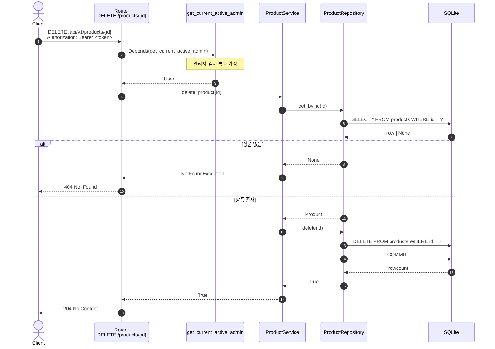
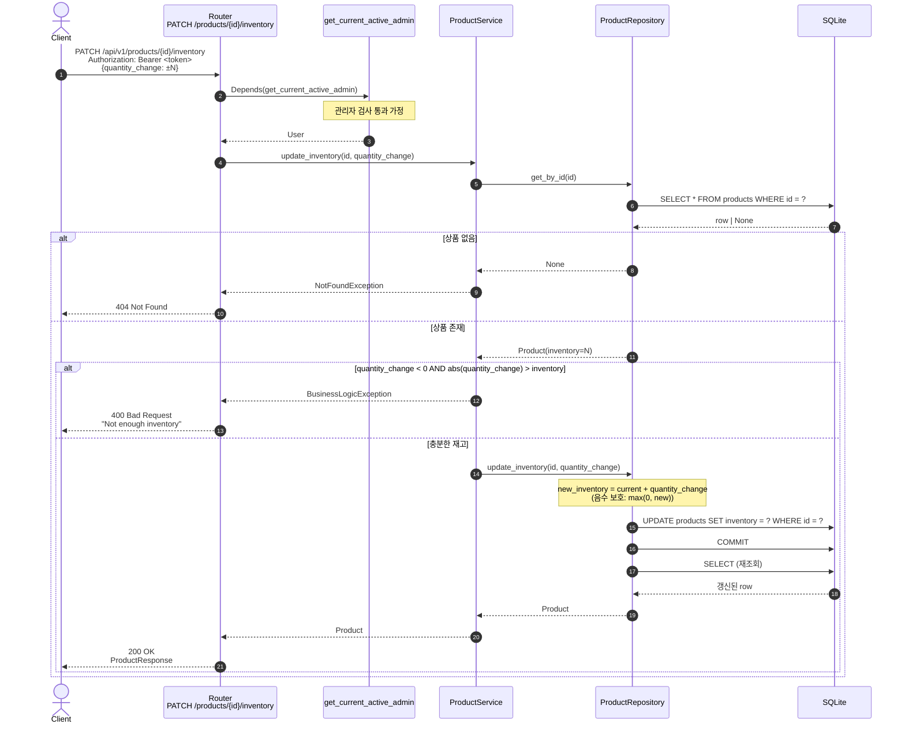

# 상품 관리 (관리자 전용)

상품의 생성/수정/삭제와 재고 변경. **모두 `get_current_active_admin` 의존성으로 보호된다.**

> 모든 다이어그램의 **인증/권한 단계는 동일** 하므로 첫 다이어그램(상품 생성)에 한 번 펼쳐 그리고, 이후에는 "관리자 검사 통과 후" 로 축약한다. 인증 단계의 상세 흐름은 [`인증_및_권한.md`](./인증_및_권한.md) 참조.

---

## 1. 상품 생성 — `POST /api/v1/products/`

| 항목     | 값                                                  |
| -------- | --------------------------------------------------- |
| 핸들러   | `app/product/router.py:22 create_product`           |
| 의존성   | `get_current_active_admin`                          |
| 요청 본문 | `ProductCreate { name, price, category, ... }`     |
| 성공     | `201 Created` + `ProductResponse`                   |
| 실패     | `401` · `403` · `400` (ValidationException)         |

### 핵심 포인트

- 입력값에 `category` 가 없으면 도메인 기본값 `ProductCategory.OTHER` 가 적용된다.
- `inventory` 미지정 시 `0`, `is_active` 미지정 시 `True`.
- 라우터에 `ValidationException` 핸들러가 선언되어 있지만 현재 `ProductService.create_product` 는 이 예외를 던지지 않는다 — 향후 비즈니스 규칙 추가를 위한 사전 배치.

---

## 2. 상품 수정 — `PUT /api/v1/products/{product_id}`

| 항목       | 값                                                              |
| ---------- | --------------------------------------------------------------- |
| 핸들러     | `app/product/router.py:54 update_product`                       |
| 의존성     | `get_current_active_admin`                                      |
| 요청 본문  | `ProductUpdate` (부분 업데이트)                                 |
| 성공       | `200 OK` + 갱신된 `ProductResponse`                             |
| 실패       | `401` · `403` · `404`                                           |

### 핵심 포인트

- 사용자 프로필 수정과 동일한 패턴 — `exclude_unset=True` + repository 내부 `v is not None` 필터.
- `inventory` 도 본 엔드포인트로 변경 가능하지만, **원자적 증감** 이 필요하면 아래의 `PATCH /inventory` 를 사용해야 한다.

---

## 3. 상품 삭제 — `DELETE /api/v1/products/{product_id}`

| 항목       | 값                                                              |
| ---------- | --------------------------------------------------------------- |
| 핸들러     | `app/product/router.py:74 delete_product`                       |
| 의존성     | `get_current_active_admin`                                      |
| 성공       | `204 No Content`                                                |
| 실패       | `401` · `403` · `404`                                           |

### 핵심 포인트

- **하드 삭제** 다. 소프트 삭제(`is_active=False`)가 필요하면 `PUT /products/{id}` 로 대체 가능.
- 서비스 계층에서 SELECT → DELETE 의 2-step 으로 존재 검증을 한 뒤 삭제 — DELETE 자체로도 `rowcount` 로 판별 가능하지만 명시적 404 를 위해 분리.

---

## 4. 상품 재고 변경 — `PATCH /api/v1/products/{product_id}/inventory`

| 항목       | 값                                                                        |
| ---------- | ------------------------------------------------------------------------- |
| 핸들러     | `app/product/router.py:107 update_product_inventory`                      |
| 의존성     | `get_current_active_admin`                                                |
| 요청 본문  | `ProductInventoryUpdate { quantity_change: int }` (양수=증가, 음수=감소) |
| 성공       | `200 OK` + 갱신된 `ProductResponse`                                       |
| 실패       | `401` · `403` · `404` · `400` (재고 부족)                                |

### 핵심 포인트

- **원자성 주의**: 현재 구현은 SELECT → 검증 → UPDATE 의 3-step. 동시에 두 요청이 들어오면 race condition 으로 음수 재고가 발생할 수 있다. 단일 SQL (`UPDATE ... SET inventory = inventory + ?`) 또는 트랜잭션 격리 수준 격상이 필요한 경우 보강 필요.
- repository 의 **이중 안전망**: `new_inventory < 0` 인 경우 0 으로 클램프 (서비스 단 검증을 통과한 후 race 등으로 음수가 되는 케이스 보호).
- `quantity_change` 가 0 이어도 UPDATE 가 실행된다 (불필요한 쓰기). 최적화 여지.
- 두 가지 예외가 다른 HTTP 코드로 매핑:
  - `NotFoundException` → 404
  - `BusinessLogicException` → 400
