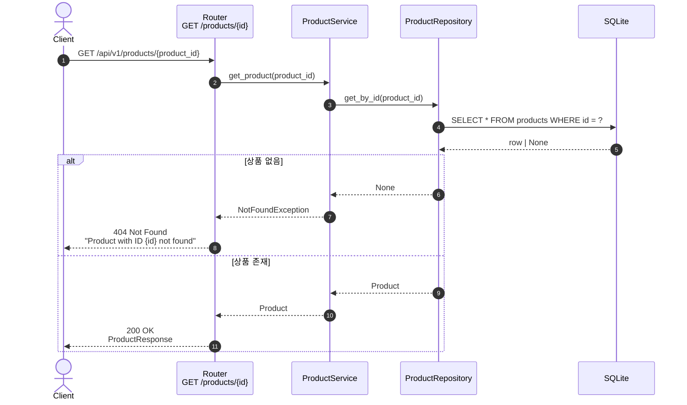
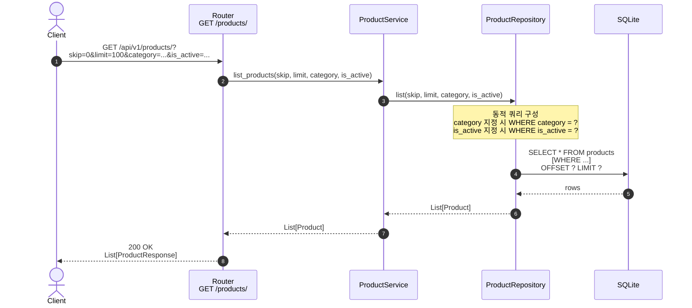

# 상품 조회

상품 단건 조회와 목록 조회. **둘 다 인증이 필요 없는 공개 엔드포인트.**

## 1. 상품 단건 조회 — `GET /api/v1/products/{product_id}`

| 항목       | 값                                                  |
| ---------- | --------------------------------------------------- |
| 핸들러     | `app/product/router.py:39 get_product_by_id`        |
| 인증       | **불필요** (공개)                                   |
| 성공       | `200 OK` + `ProductResponse`                        |
| 실패       | `404 Not Found`                                     |

### 핵심 포인트

- 응답에는 비활성 상품(`is_active=False`)도 포함된다. 비활성 상품 노출을 막으려면 서비스 계층에서 필터링 추가가 필요.

---

## 2. 상품 목록 조회 — `GET /api/v1/products/`

| 항목          | 값                                                                            |
| ------------- | ----------------------------------------------------------------------------- |
| 핸들러        | `app/product/router.py:90 list_products`                                      |
| 인증          | **불필요** (공개)                                                             |
| 쿼리 파라미터 | `skip`, `limit`, `category` (enum), `is_active` (bool)                        |
| 성공          | `200 OK` + `List[ProductResponse]`                                            |

### 핵심 포인트

- **필터는 옵셔널** 이다. `category` / `is_active` 미지정 시 해당 조건은 WHERE 절에 추가되지 않는다.
- `is_active is not None` 으로 체크 — `False` 도 명시적 필터로 인정 (즉 비활성 상품만 조회 가능).
- `category` 는 `ProductCategory` enum 으로 검증되어, 유효하지 않은 값은 FastAPI 단계에서 422 로 거절된다.
- 빈 결과는 빈 리스트 (`[]`) 로 정상 응답. 404 가 아님.
