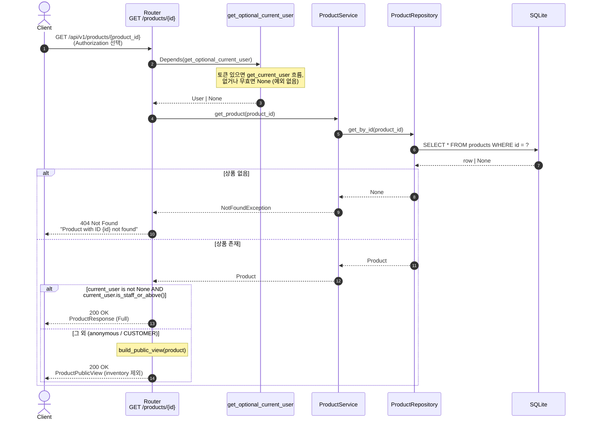
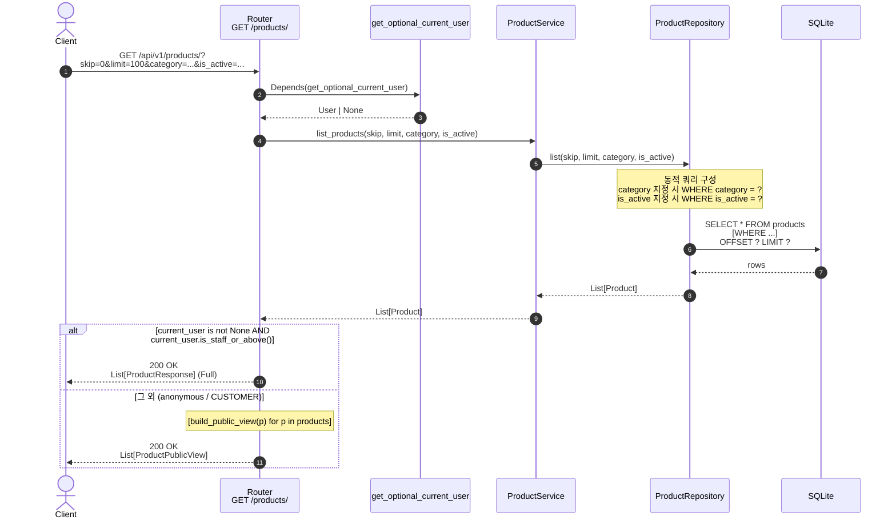

# 상품 조회

상품 단건 조회와 목록 조회. **선택적 인증** — 토큰이 없어도 접근 가능하지만, viewer 의 권한 계층 (`is_staff_or_above()`) 에 따라 응답 컨텍스트가 달라진다 (PR #19).

## 1. 상품 단건 조회 — `GET /api/v1/products/{product_id}`

| 항목       | 값                                                                          |
| ---------- | --------------------------------------------------------------------------- |
| 핸들러     | `app/product/router.py` `get_product_by_id`                                 |
| 인증       | **선택적** (`get_optional_current_user`)                                    |
| 성공       | `200 OK` + `Union[ProductPublicView, ProductResponse]`                      |
| 실패       | `404 Not Found`                                                             |

- anonymous / CUSTOMER → `ProductPublicView` (inventory 제외)
- STAFF / ADMIN → `ProductResponse` (전체, inventory 포함)

### 핵심 포인트

- **`ProductPublicView` = `ProductResponse` 에서 `inventory` 필드 제외** (PR #19). 일반 사용자에게는 영업 정보 (재고) 가 노출되지 않는다.
- **viewer 컨텍스트 결정 진실원**: `app/product/router.py` 의 `get_product_by_id` / `list_products` 본문의 `if current_user is not None and current_user.is_staff_or_above()` 분기.
- 응답에는 비활성 상품(`is_active=False`)도 포함된다. 비활성 상품 노출을 막으려면 서비스 계층에서 필터링 추가가 필요.
- 권한 계층 (CUSTOMER ⊂ STAFF ⊂ ADMIN) 과 가드 매트릭스는 [`RUNBOOK §9`](../RUNBOOK.md) 참조.

---

## 2. 상품 목록 조회 — `GET /api/v1/products/`

| 항목          | 값                                                                                       |
| ------------- | ---------------------------------------------------------------------------------------- |
| 핸들러        | `app/product/router.py` `list_products`                                                  |
| 인증          | **선택적** (`get_optional_current_user`)                                                 |
| 쿼리 파라미터 | `skip`, `limit`, `category` (enum), `is_active` (bool)                                   |
| 성공          | `200 OK` + `Union[List[ProductPublicView], List[ProductResponse]]`                       |

### 핵심 포인트

- **필터는 옵셔널** 이다. `category` / `is_active` 미지정 시 해당 조건은 WHERE 절에 추가되지 않는다.
- `is_active is not None` 으로 체크 — `False` 도 명시적 필터로 인정 (즉 비활성 상품만 조회 가능).
- `category` 는 `ProductCategory` enum 으로 검증되어, 유효하지 않은 값은 FastAPI 단계에서 422 로 거절된다.
- 빈 결과는 빈 리스트 (`[]`) 로 정상 응답. 404 가 아님.
- **viewer 분기는 본문 후처리** — service/repository 는 viewer 를 모르고 항상 전체 `Product` 도메인 객체를 반환. 응답 마스킹은 라우터의 책임 (관심사 분리).
