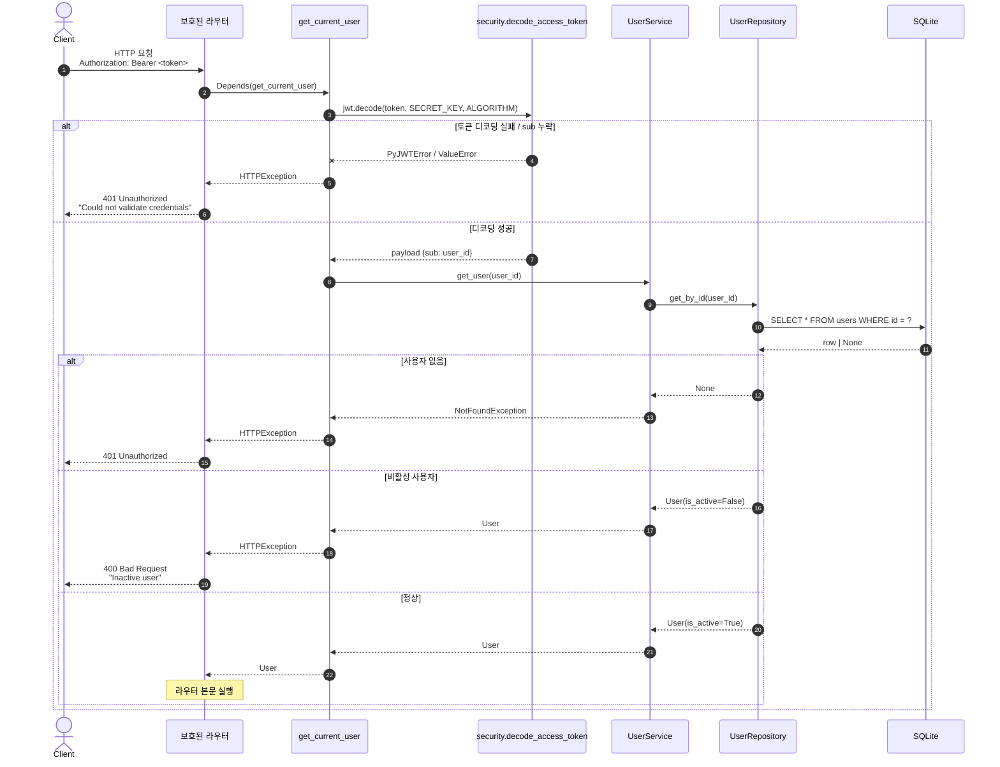
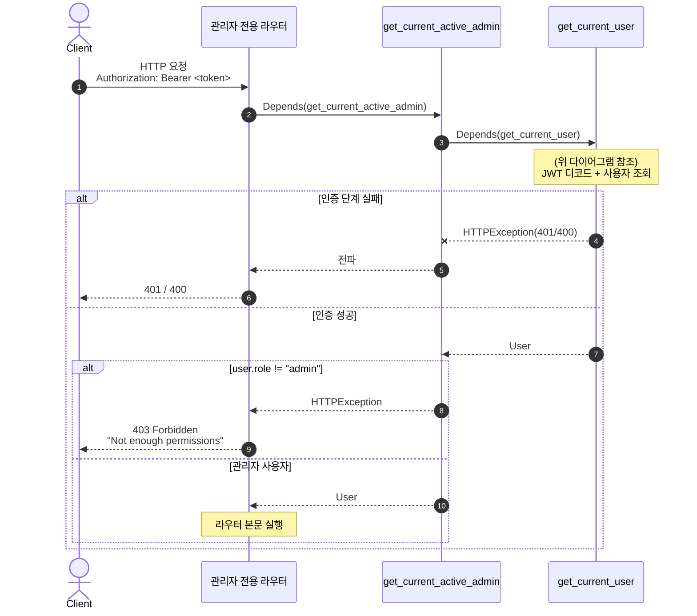

# 인증 및 권한 의존성

`app/api/dependencies.py` 의 `get_current_user` / `get_current_active_admin` 흐름.
보호된 엔드포인트는 모두 이 두 의존성 중 하나를 거친다.

## 1. `get_current_user` — JWT 인증

| 항목       | 값                                                                                   |
| ---------- | ------------------------------------------------------------------------------------ |
| 소스       | `app/api/dependencies.py:20`                                                         |
| 사용처     | `GET /users/me`, `PUT /users/me`, `GET /users/{id}`, `POST /products/` 등 다수       |
| 입력       | `Authorization: Bearer <JWT>` 헤더 (OAuth2PasswordBearer)                            |
| 성공 출력  | `User` 도메인 객체                                                                   |
| 실패 응답  | `401` (토큰 무효 / 사용자 없음) · `400` (비활성 사용자)                              |

## 2. `get_current_active_admin` — 관리자 권한 가드

| 항목       | 값                                                                                  |
| ---------- | ----------------------------------------------------------------------------------- |
| 소스       | `app/api/dependencies.py:60`                                                        |
| 사용처     | `GET /users/`, `POST · PUT · DELETE /products/`, `PATCH /products/{id}/inventory`  |
| 전제       | 내부에서 `get_current_user` 를 먼저 호출                                            |
| 검사       | `user.role == "admin"`                                                              |
| 실패 응답  | `403 Forbidden "Not enough permissions"`                                            |

## 핵심 포인트

- **`OAuth2PasswordBearer` 의 `tokenUrl`** 은 `/api/v1/users/token` 이며 Swagger UI 의 Authorize 버튼이 이 경로를 호출한다.
- **`role` 비교는 문자열 매칭** (`"admin"`) 이다. `app/user/domain.py` 의 `UserRole` enum 과의 정합성은 별도 점검 필요 (PRD 잔여 이슈 #1).
- `get_current_active_admin` 은 `get_current_user` 가 던지는 예외를 **그대로 전파** 한다. 즉 인증 실패 시 401, 비활성 사용자 시 400, 권한 부족 시 403 의 3단계 매핑이 자동으로 적용된다.
