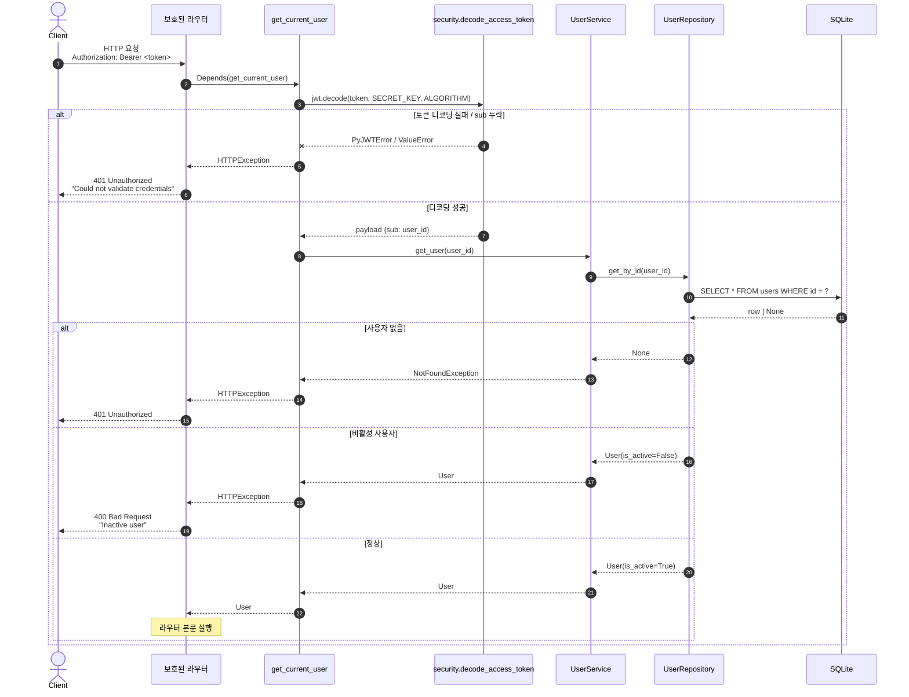
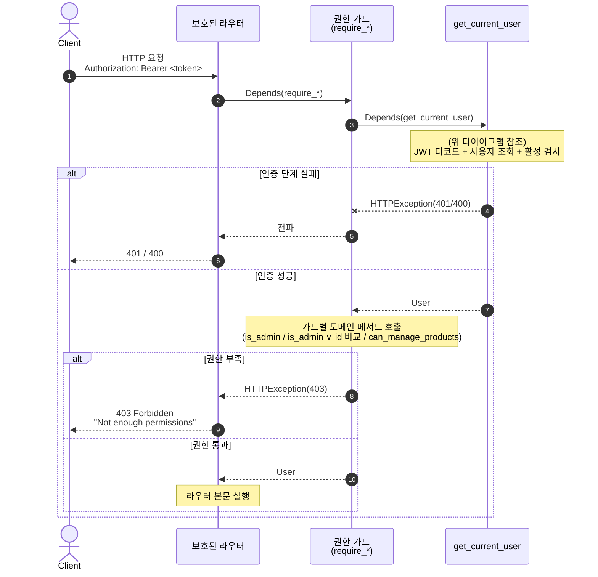

# 인증 및 권한 의존성

`app/api/dependencies.py` 의 인증 (`get_current_user` / `get_optional_current_user`) 과
`app/api/permissions.py` 의 권한 가드 (`require_admin` / `require_self_or_admin` / `require_staff_or_admin`) 흐름.
보호된 엔드포인트는 인증 → (필요 시) 권한 가드 순서로 통과한다.

## 1. `get_current_user` — JWT 인증

| 항목       | 값                                                                                   |
| ---------- | ------------------------------------------------------------------------------------ |
| 소스       | `app/api/dependencies.py:20`                                                         |
| 사용처     | `GET /users/me`, `PUT /users/me`, 권한 가드의 사전 단계 (모든 보호 엔드포인트)       |
| 입력       | `Authorization: Bearer <JWT>` 헤더 (OAuth2PasswordBearer)                            |
| 성공 출력  | `User` 도메인 객체                                                                   |
| 실패 응답  | `401` (토큰 무효 / 사용자 없음) · `400` (비활성 사용자)                              |

> 자매 의존성 `get_optional_current_user` 는 토큰이 있으면 동일 흐름, 없거나 무효면 `None` 반환 (예외 없음). Product 조회 (`GET /products/{id}`, `GET /products/`) 의 viewer 분기에 사용된다 (PR #19).

## 2. 권한 가드 (`app/api/permissions.py`)

인증 통과 후 "누가 무엇을 할 수 있는가" 정책. 가드는 도메인 메서드 (`User.is_admin()` 등) 만 호출 — 정책의 진실원은 `app/user/domain.py` 의 메서드들이다 (PR #20 모듈 분리, PR #26 명명 통일).

| 가드 | 통과 조건 | 호출 도메인 메서드 | 사용처 |
| --- | --- | --- | --- |
| `require_admin` | ADMIN | `is_admin()` | `GET /users/`, `GET /users/{id}` 타인 응답 분기 |
| `require_self_or_admin` | 본인 (`id == user_id`) ∨ ADMIN | `is_admin()` | `GET /users/{id}` |
| `require_staff_or_admin` | STAFF 이상 | `can_manage_products()` | `POST · PUT · DELETE /products/{id}`, `PATCH /products/{id}/inventory` |

> 모든 가드는 내부에서 `get_current_user` 를 먼저 호출 → 인증 실패 (401/400) 가 권한 검사 (403) 보다 먼저 평가된다.

## 핵심 포인트

- **`OAuth2PasswordBearer` 의 `tokenUrl`** 은 `/api/v1/users/token` 이며 Swagger UI 의 Authorize 버튼이 이 경로를 호출한다.
- **인증 ↔ 권한 모듈 분리**: 인증은 `app/api/dependencies.py`, 권한 가드는 `app/api/permissions.py` (PR #20). 의존성 트리는 `Route → require_* → get_current_user`.
- **권한 비교는 도메인 메서드로 캡슐화**: `User.is_admin()` / `User.is_staff_or_above()` / `User.can_manage_products()`. 가드는 정책을 직접 코드로 표현하지 않고 도메인 메서드를 호출만 (PR #26) — 역할 계층이 확장되면 도메인 한 곳만 수정.
- **선택적 인증 (`get_optional_current_user`)**: Product 조회는 인증을 강제하지 않고 viewer 권한에 따라 응답 컨텍스트를 분기 (PR #19, `상품_조회.md` 참조).
- **에러 코드 매핑 (3단계)**: 인증 실패 401, 비활성 400, 권한 부족 403 — 가드는 `get_current_user` 의 401/400 을 그대로 전파.
- **운영자 진실원**: 가드 × 엔드포인트 매트릭스는 `docs/RUNBOOK.md` §9 (PR #27) 참조.
