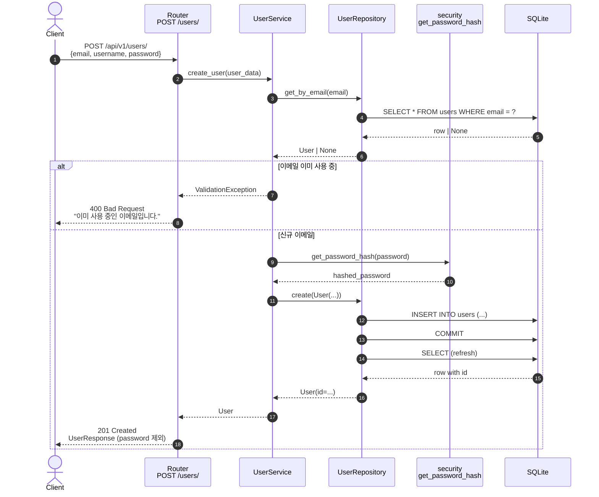
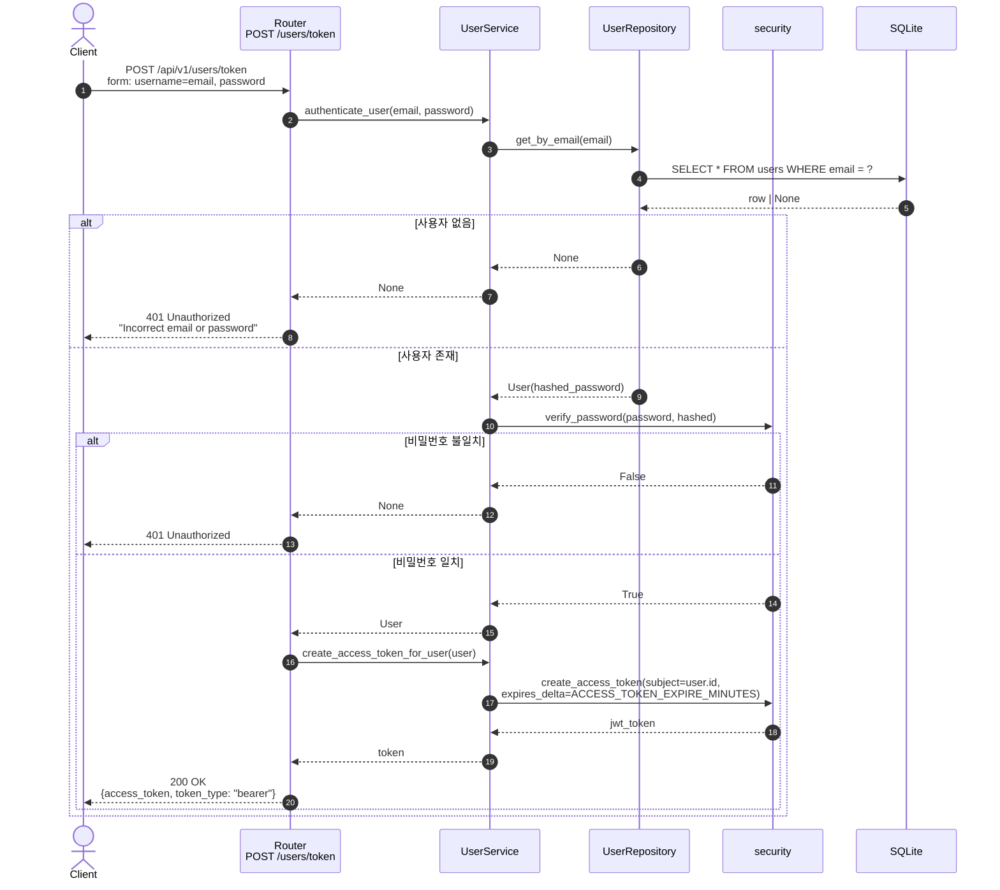

# 회원가입 · 로그인

신규 사용자 생성과 토큰 발급. 두 엔드포인트 모두 **인증이 필요 없다.**

## 1. 회원가입 — `POST /api/v1/users/`

| 항목     | 값                                                       |
| -------- | -------------------------------------------------------- |
| 핸들러   | `app/user/router.py:22 create_user`                      |
| 요청 본문 | `UserCreate { email, username, password, ... }`          |
| 성공     | `201 Created` + `UserResponse`                           |
| 실패     | `400 Bad Request` (이메일 중복)                          |

### 핵심 포인트

- **비밀번호는 평문이 DB 에 도달하지 않는다.** `UserService.create_user` 내부에서 `user_data.pop("password")` 로 꺼내 `get_password_hash` (bcrypt) 적용 후 `hashed_password` 로 저장.
- 응답 직렬화는 `UserResponse` (Pydantic) 가 담당하므로 `hashed_password` 가 외부로 노출되지 않는다.
- 회원가입 자체는 `role` 을 지정하지 않으면 도메인 기본값 (`UserRole.CUSTOMER`) 이 적용된다.

---

## 2. 로그인 (토큰 발급) — `POST /api/v1/users/token`

| 항목     | 값                                                       |
| -------- | -------------------------------------------------------- |
| 핸들러   | `app/user/router.py:62 login_for_access_token`           |
| 요청     | `OAuth2PasswordRequestForm` (`username`=email, `password`) |
| 성공     | `200 OK` + `{ access_token, token_type: "bearer" }`      |
| 실패     | `401 Unauthorized`                                       |

### 핵심 포인트

- **OAuth2 호환**: 요청은 `application/x-www-form-urlencoded` 의 `username` / `password` 필드. 본 프로젝트는 `username` 자리에 **이메일** 을 사용한다.
- 사용자 미존재와 비밀번호 불일치는 **동일한 401 응답** 으로 통합 (계정 열거 공격 방지).
- 토큰의 `sub` payload 에는 `user.id` (정수) 를 문자열로 저장 → 이후 `get_current_user` 가 `int(payload["sub"])` 로 파싱.
- 만료 시간은 `settings.ACCESS_TOKEN_EXPIRE_MINUTES` 기본값을 사용.
